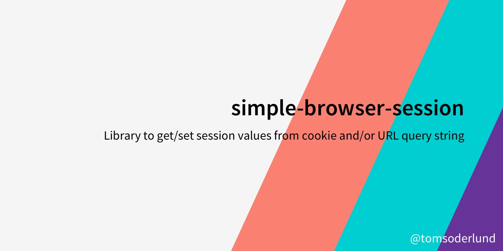

# simple-browser-session

Library to get/set session values from localStorage/cookie and/or URL query string.

## How to use

    yarn add simple-browser-session

Then import:

    import { getSessionValue, setSessionValue } from 'simple-browser-session'

Get a value:

    getSessionValue(property, defaultValue, options = { useHash: false, useCookies: false, cookieName: 'app' })

Set a value:

    setSessionValue(property, value, options = { updateStored: true, updatePath: false, useHash: false, useCookies: false, cookieName: 'app' })

## Options

- `cookieName`: `app` as default.
- `updateStored`: true/false, update localStorage/cookie
- `updatePath`: true/false, update browser URL
- `useCookies`: false as default, uses localStorage if not true.
- `useHash`: true/false, uses values after # in URL if true.

## How it works

simple-browser-session uses localStorage, or creates a cookie called `app` (this can be changed with the `cookieName` prop).

localStorage/cookie contains a (serialized) JSON object with all the values that you save with `setSessionValue`.

simple-browser-session uses both the URL query string (e.g. `?name=value`) and localStorage/cookie. Query strings have precedence over localStorage/cookie.
